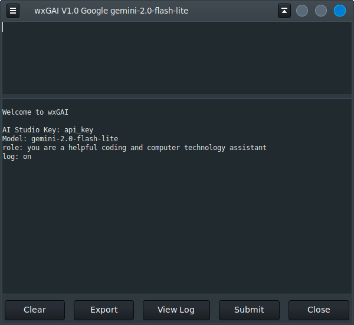

# wxGAI
## Desktop Front-End for Google Gemini Query

wxGAI is similar to [wxAI](https://github.com/MLeidel/wxAI "Git Website") which uses OpenAI.

You will need a Google AI Studio api-key to use this program.

wxGAI is written in Python3 with wxPython producing 
the theme integrated GTK GUI look-and-feel
on Linux and a true _light_ theme look on Windows.

The wxGAI `options.ini` file must be edited manually.

At this time this is what an `options.ini` might contain:

        # wxGAI.py
        gemini=MyKey
        model=gemini-2.0-flash-lite
        role=you are a helpful coding assistant
        log=on
        fontsz1=10
        fontsz2=12

The **Export** button converts the markdown response to HTML and presents it in the
system default browser. 

The other function buttons are self explanatory.

---

## Hot Keys

        Ctrl-H     This help message
        Ctrl-F     Find text
        Ctrl-N     Find next
        Ctrl-Q     Quit App
        Ctrl-G     Execute AI request
        Alt-Ctrl-C
                   Copy Code in Markup
---

wxGAI requires these other python3 modules:

        markdown
        wx
        google.generativeai

To run:

      $ python3 wxGAI.py
    
---

## Environment Variables

### [Linux](https://linuxize.com/post/how-to-set-and-list-environment-variables-in-linux/ "How To") [Windows](https://superuser.com/questions/949560/how-do-i-set-system-environment-variables-in-windows-10/ "How To")

